<h3>johna108@github ~ $ ./contributions.sh</h3>

  

<h3>johna108@github ~ $ whoami</h3>
<table>
  <tr>
    <td valign="top"></td>
    <td valign="top"></td>
  </tr>
</table>

## About

This profile is built from generated SVG assets only. The portrait and info card are static artifacts; the contribution heatmap is refreshed daily from public GitHub HTML.

## Regenerate

1. Install dependencies from [scripts/requirements.txt](scripts/requirements.txt).
2. Add a photo as `source-photo.jpg` if you want to regenerate the ASCII portrait.
3. Run `python scripts/prep_photo.py source-photo.jpg`.
4. Run `python scripts/make_ascii_svg.py` and `python scripts/make_info_card.py`.
5. Run `python scripts/fetch_contributions.py` and `python scripts/render_heatmap_svg.py`.

## Workflow

The daily refresh lives in [.github/workflows/update-profile-art.yml](.github/workflows/update-profile-art.yml).
